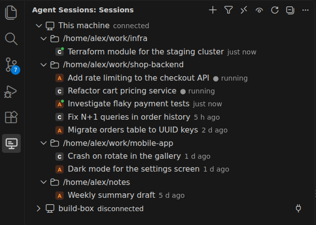

# Agent Sessions

All your AI coding sessions in one VS Code side bar: Claude Code and Codex,
on this machine and on remote machines over ssh, with live statuses, unread
marks, and one-click resume in the agent's own plugin.

VS Code's built-in "Chat Sessions" view only knows the agents that plug into
it, does not tell Claude sessions from Codex ones, and opens Claude sessions
in Copilot rather than in the Claude Code extension. Agent Sessions reads the
agents' own session stores instead and stays out of their way.



## Features

- **One tree for every agent.** Sessions are grouped by machine and project.
  Each row shows the agent icon, the title the agent gave the session, and how
  long ago it was last active.
- **Live status.** A running session gets a green dot. Claude Code status
  comes from its process registry; Codex status comes from the last turn
  event in the rollout, so an abandoned turn is not shown as running forever.
- **Unread marks.** A session that finished work since you last opened it is
  marked with `●`. Opening a session in Claude Code or Codex does not count
  as activity, so merely looking at old sessions keeps them read. A session
  whose tab is active in the focused window is read as it goes.
- **Opens in the native plugin.** Double-click a Claude session and it opens
  in the Claude Code extension; a Codex session opens in the Codex plugin,
  in its side bar or in an editor tab. "Resume in Terminal" prepares the CLI
  command instead.
- **Remote machines.** Add any host from `~/.ssh/config`. The extension
  installs a small daemon on the remote machine, brings its own Node when the
  host has none, and streams that machine's sessions into the same tree.
  Double-clicking a remote session opens it in a Remote-SSH window on that
  machine.
- **Housekeeping.** Pin the sessions you keep coming back to, rename them,
  hide the ones you no longer care about, mark them read or unread, delete
  them for good, and apply most of that to a multi-selection.
- **One daemon per machine.** All VS Code windows share one background
  process, so opening a second window does not rescan anything.

## Requirements

- VS Code 1.96 or newer on Linux or macOS. Windows is not supported.
- The [Claude Code](https://marketplace.visualstudio.com/items?itemName=anthropic.claude-code)
  and [Codex](https://marketplace.visualstudio.com/items?itemName=openai.chatgpt)
  extensions for opening sessions in place. Listing sessions works without
  them.
- For remote machines: ssh access that works without prompts
  (`BatchMode=yes`), and either Node 20+ on the host or the ability to
  download Node 22 from nodejs.org.

## Getting started

1. Install the extension and reload the window. The **Agent Sessions** icon
   appears in the activity bar.
2. "This machine" connects on its own and lists the sessions found in
   `~/.claude` and `~/.codex`.
3. To watch a remote machine, click **Add Machine** in the view header, pick
   a host from your ssh config, and let **Prepare Machine** finish. The
   machine then connects and shows its sessions.

## Working with sessions

| Action | How |
| --- | --- |
| Open a session | Double-click it (or single-click with `agentSessions.openOn` set to `singleClick`). "Open Session" in the context menu always opens immediately. |
| Open a Claude session of another folder | Claude Code finds only sessions of the folder open in its window and its git worktrees, so such a session offers "Open Folder in New Window", which then opens the session there, or "Resume in Terminal". |
| Open a remote session | Double-click opens a Remote-SSH window on the session folder of that machine (or focuses the one already open) and opens the session there. The machine's daemon must speak the current protocol; run **Prepare Machine** after updating the extension. |
| Resume in a terminal | "Resume in Terminal" opens a terminal in the session folder with `claude --resume <id>` or `codex resume <id>` typed in, not run. |
| Start a new session | The plus button that appears on a folder under the pointer, or "New Session…" in its context menu, asks for the agent, Claude Code or Codex, and starts a session in that folder: in this window when the folder is open in it, otherwise in a new window on the folder, a Remote-SSH one for a remote machine. |
| Mark read / unread | Context menu. Opening a session marks it read, and so does having its editor tab active in the focused window: switching to the tab or back to the window clears the mark. A session shown in the Claude Code or Codex sidebar is not detected. |
| Hide / unhide | The crossed-out eye button that appears on a session under the pointer, to the left of the pin, or "Hide Session" in the context menu, removes the session from the tree; the eye button in the header shows hidden sessions dimmed with the word `hidden`. On a hidden session the button turns into an eye that brings the session back. |
| Pin / unpin | The pin button that appears on a session under the pointer, or "Pin Session" in the context menu, moves the session to the top of its folder and adds a pin to its icon. The same button on a pinned session unpins it. |
| Rename | The pencil button that appears on a Claude Code or Codex session under the pointer, to the left of the eye, "Rename Session…" in the context menu, or F2 in the focused list asks for a new name and has the agent itself write it, see below. |
| Folder actions | A folder's context menu marks the sessions shown under it read or unread, deletes them, or hides the folder as a whole. Hiding a folder does not change the marks of its sessions: unhide it and a session hidden on its own stays hidden. |
| Delete | "Delete Session…" or the Delete key (Cmd+Backspace on macOS) in the focused list asks once and deletes permanently, see below. |
| Several at once | Shift-click and Ctrl-click select several sessions; pin, hide, delete and mark-as-read then apply to the whole selection. |
| Copy the id | "Copy Session ID". |

### Filter

The **Filter Sessions** button opens one list with three sections:

- **Agents**: which agents to show.
- **Projects**: "Only the workspace open in this window" keeps, on this
  machine, the sessions whose folder is open in the window. Remote machines
  are not affected.
- **Remote machines**: "Show remote machines" toggles the remote machines,
  same as the header button.

The button icon is filled while the filter restricts anything. The filter is
remembered per window.

### Renaming sessions

A new name is written by the agent's own tooling on the machine that holds
the session, so Claude Code and Codex show it too, in `claude --resume`,
`codex resume` and their VS Code extensions, and it works for remote
machines:

- Claude Code: `renameSession` from the Agent SDK appends a title to the
  session file, as `/rename` does.
- Codex: a `thread/name/set` request to a `codex app-server` started for it
  lets Codex update its own session index.

A session that is running or open in its agent can be renamed as well. A
Codex window that has the session open may show the old name until it is
reloaded.

### Deleting sessions

Deletion is permanent and is carried out by the agent's own tooling on the
machine that holds the session, so it also works for remote machines:

- Claude Code: `deleteSession` from the Agent SDK removes the session file and
  its subagent transcripts.
- Codex: `codex delete --force <id>` lets Codex update its own indexes.

A running session cannot be deleted. A session that is currently loaded in
the Codex plugin cannot be deleted either, because Codex holds a lock on it
until the window is reloaded; the error message says so.

## Remote machines

**Add Machine** lists the `Host` entries of `~/.ssh/config`. The extension
stores only the host name in its own `machines.json`; address, user and key
stay in your ssh config.

**Prepare Machine** runs over ssh: it checks the platform (Linux or macOS,
x64 or arm64), looks for Node 20+, downloads Node 22.15.0 into
`~/.local/share/agent-sessions/` when there is none, copies the daemon there
and verifies it. Run it again after updating the extension.

The ssh connection uses `BatchMode=yes`, `RemoteCommand=none` and
`RequestTTY=no`, so hosts that force an interactive shell in ssh config still
work, and no password prompt can appear.

Opening a remote session in place is not possible yet; remote sessions are
shown with their status and can be hidden, marked and deleted.

## The local daemon

One `daemon.mjs --listen` process per machine serves every VS Code window
over a unix socket. The first window starts it, later windows attach, and it
exits by itself after 60 seconds without clients.

- Socket, pid and log: `$XDG_RUNTIME_DIR/agent-sessions/` on Linux,
  `~/.local/share/agent-sessions/` where `XDG_RUNTIME_DIR` is not set (macOS).
- The directory is private (`0700`); a directory left with wider permissions
  is narrowed, one owned by someone else is refused.
- The daemon inherits the environment of the window that started it
  (`CLAUDE_CONFIG_DIR`, `CODEX_HOME`, `PATH`).
- After an extension update the windows notice the version mismatch and
  restart the daemon. **Restart Local Daemon** does the same by hand and
  kills a daemon that does not exit.

If "This machine" stays disconnected, run **Restart Local Daemon** and look
at **Show Log**; the daemon's own log is `daemon.log` next to the socket.

## Settings

| Setting | Default | Meaning |
| --- | --- | --- |
| `agentSessions.openOn` | `doubleClick` | Open a session on double click; `singleClick` opens on the first click. |
| `agentSessions.codex.openTarget` | `sidebar` | Open Codex sessions in the Codex side bar or in an editor `panel`. |
| `agentSessions.showHidden` | `false` | Show hidden sessions in the tree. |
| `agentSessions.autoConnectOnStartup` | `true` | Connect the local machine and machines marked `autoConnect` on startup. |
| `agentSessions.ssh.path` | `ssh` | The ssh binary used for remote machines. |

Machines are kept in `machines.json` under the extension's global storage;
the file can be edited by hand (for example to set `"autoConnect": true`).

## How it works

```
packages/core       session model and providers (Claude via Agent SDK + process registry,
                    Codex via rollout files); no VS Code dependency
packages/daemon     one bundle that runs the providers and speaks JSON lines
                    over stdio (remote, via ssh) or a unix socket (local, shared)
packages/extension  the VS Code side: machines, ssh, tree, commands
```

The daemon watches the agents' directories and polls as a fallback, sends a
snapshot on connect and diffs afterwards. Session files are never modified,
except by the explicit delete command.

## Development

```
npm install
npm run build
npm test
```

Press F5 in VS Code to run the extension in an Extension Development Host.
`npm run package -w agent-sessions` builds the `.vsix`.

### Demo data and screenshots

`npm run demo` writes fake Claude Code and Codex session stores to `.demo/`
(git-ignored); nothing in `~/.claude` or `~/.codex` is touched. The
"Run Extension (demo data)" launch configuration starts a development host on
that data with other extensions disabled and opens the view. `npm run
demo:touch` appends fresh activity to two sessions so that unread marks
appear. The screenshot above was taken this way.

## Credits

The Codex rollout discovery and parsing was ported from
[Codex History Viewer](https://github.com/hiztam/codex-history-viewer) (MIT).
See `THIRD_PARTY_NOTICES.md`.

## License

MIT
